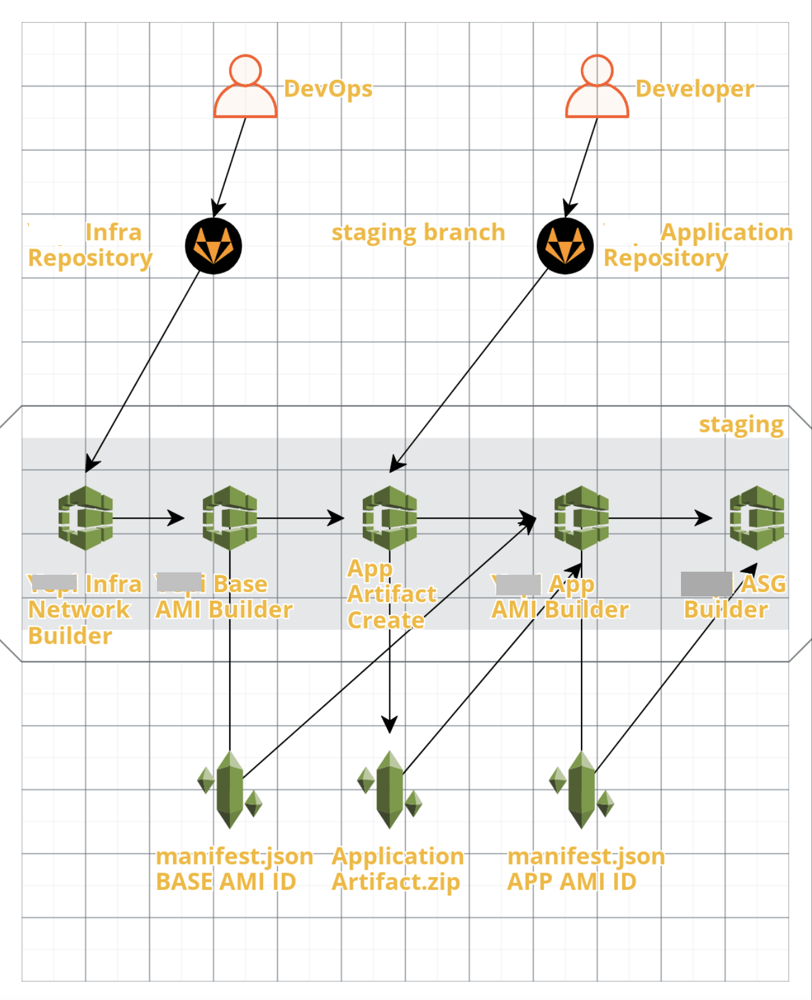
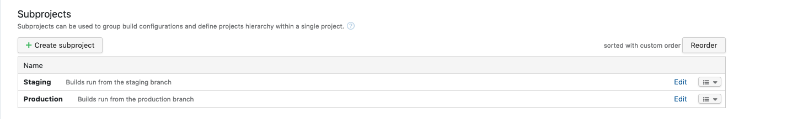
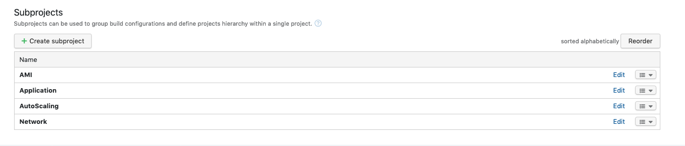
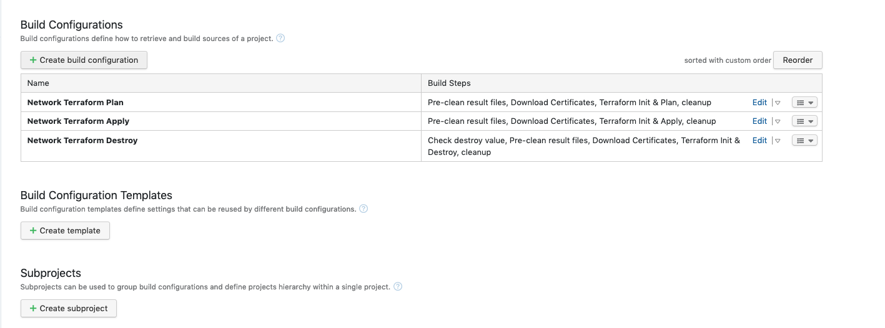
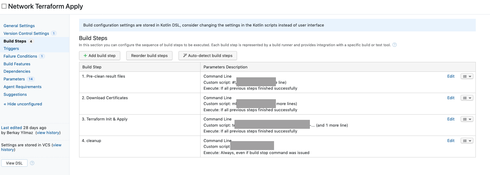

# teamcity-kotlin-dsl-sample-project-structure
TeamCity Sample Project Creation with Kotlin DSL

## Objective

* Build Staging and Production environment which have AMI, Application, AutoScaling, Network folders.

## Prerequisites

* Knowledge about [Kotlin DSL](https://proandroiddev.com/writing-dsls-in-kotlin-part-1-7f5d2193f277).
* In order to configure Kotlin DSL check this [link](https://blog.jetbrains.com/teamcity/2019/03/configuration-as-code-part-1-getting-started-with-kotlin-dsl).

## File Structure
| File Name                     | Purpose                                                        |
| -------------                 |:-------------                                                  |
| settings.kts                  | Root File which calls Project.kt 								 |
| Project.kt               		| Creating Staging and Production environments		             |
| Helpers.kt    				| Creating VCS Roots								             |
| buildTypes                    | These files have build configurations and steps in TeamCity    |

## Project Output

1. 

2. 

3. 

4. 

**Enjoy!**
 